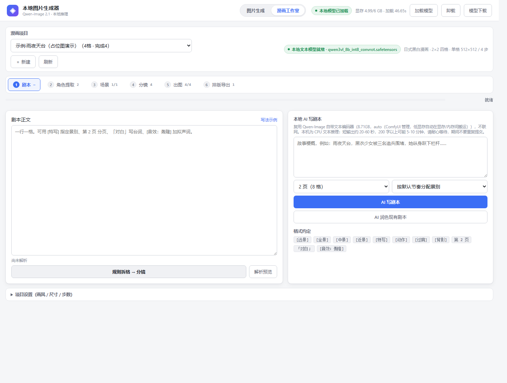
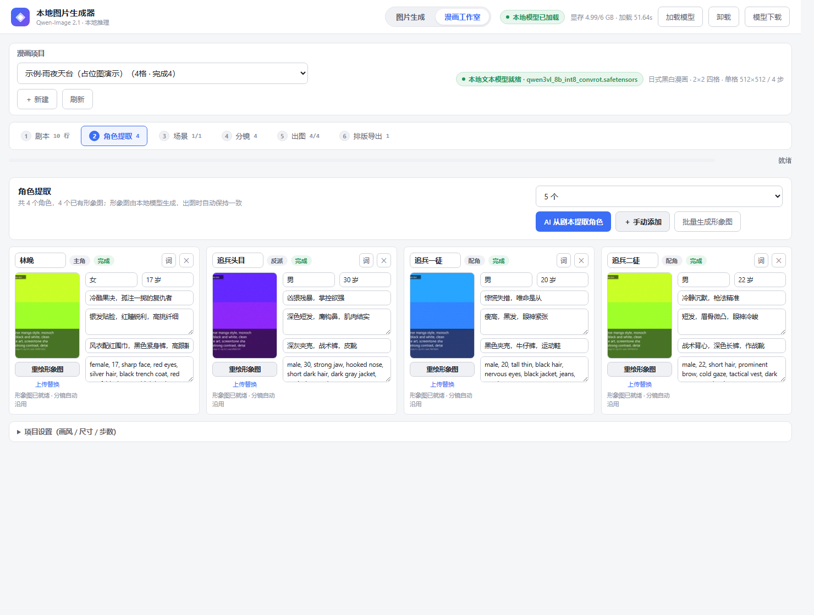
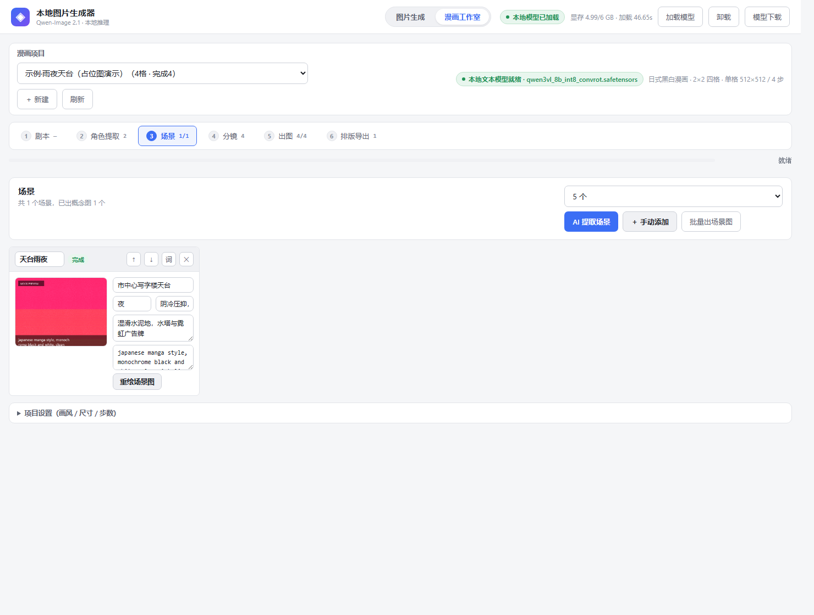
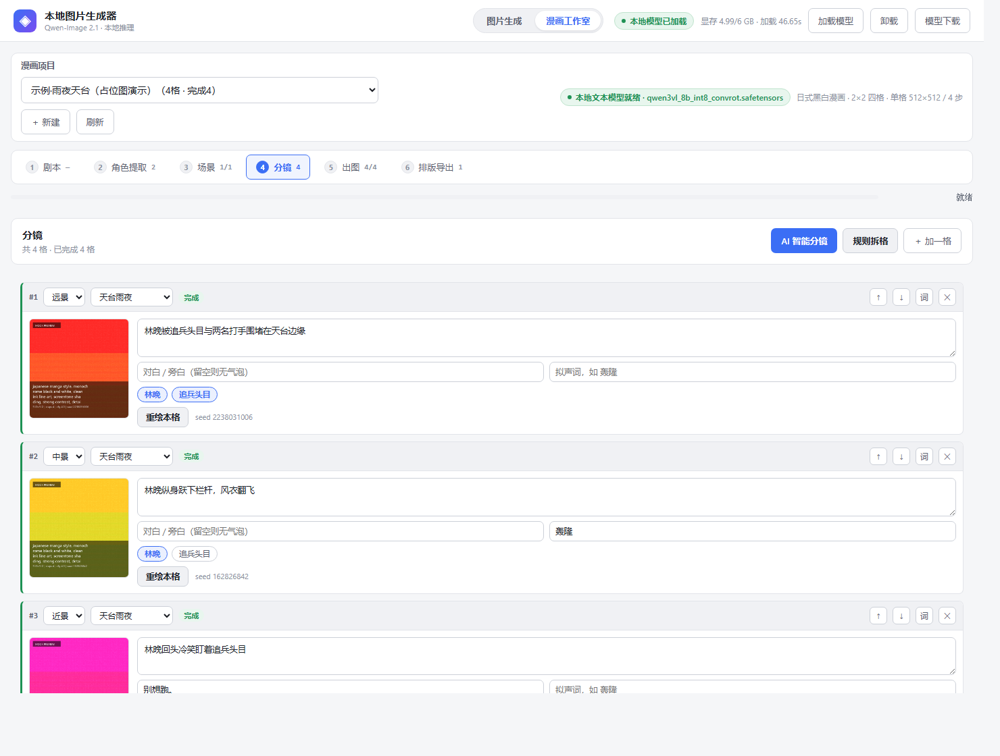
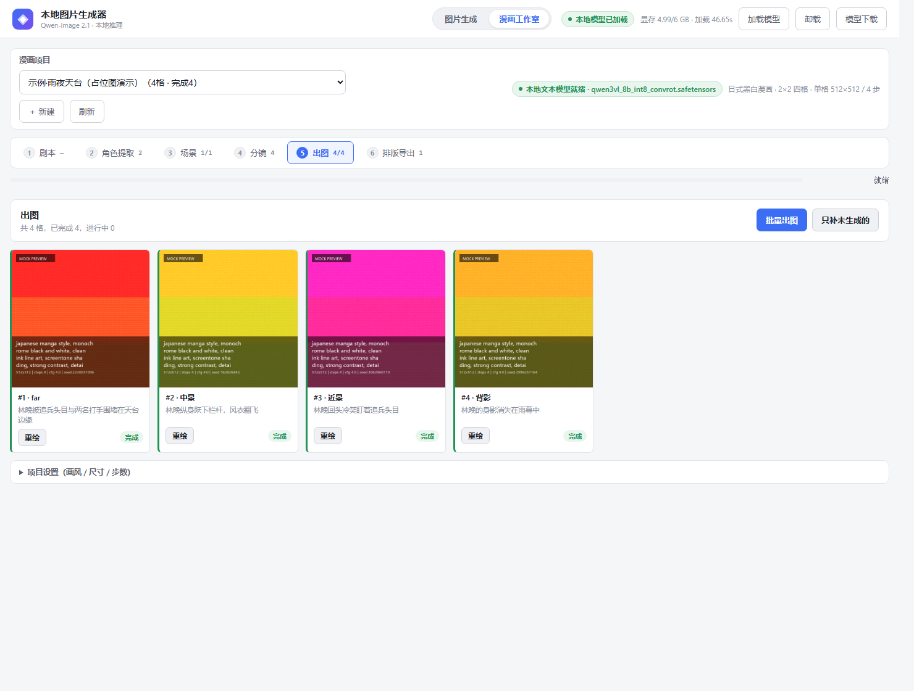
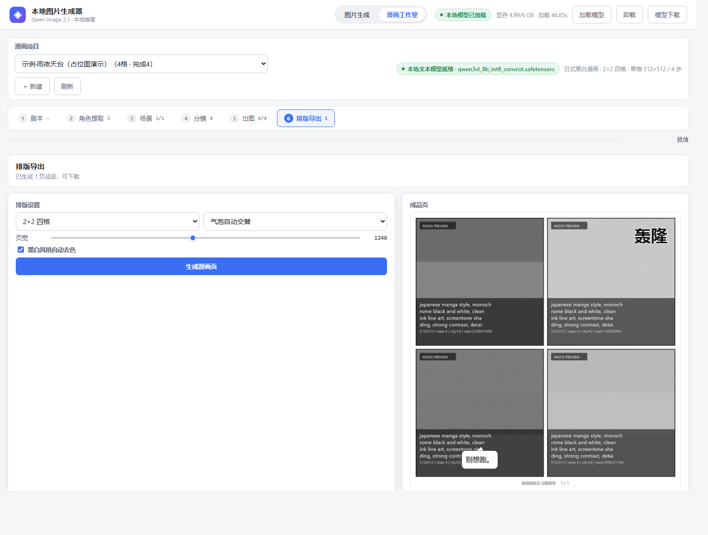

<div align="center">

# QwenImage Comic · 本地 AI 漫画工作室

**完全离线运行的 AI 漫画 / 图片生成器** —— 从一段剧本到一部带气泡、可导出 PDF 的成漫，
全程不联网、不调用任何在线 API，数据 100% 留在自己电脑上。

`FastAPI` · `ComfyUI` · `Qwen-Image 2.1 (GGUF)` · `Qwen3-VL-8B` · `原生 HTML/JS`

[](https://www.python.org/)
[](https://fastapi.tiangolo.com/)
[](https://github.com/comfyanonymous/ComfyUI)
[](#开源许可)

</div>

---

## 这是什么

输入一段剧本，它会自动完成：**剧本解析 → AI 提取角色 → AI 生成角色立绘 → AI 提取场景 →
AI 智能分镜 → 逐格出图（角色 + 场景融合）→ 拼页排版（气泡/拟声词/页码）→ 一键导出整部 PDF**。

- **文本理解**：复用出图模型自带的 `Qwen3-VL-8B` 文本编码器，通过 ComfyUI `TextGenerate` 节点本地推理，**不需要再下载语言模型**
- **出图引擎**：`Qwen-Image-2.1-Uncensored-GGUF`，走 ComfyUI + ComfyUI-GGUF 通道
- **角色一致性**：使用 Qwen-Image 2.1 官方多参考图编辑通道（`TextEncodeQwenImage21`），场景概念图 + 角色立绘一起喂给模型"边看图边重画"，不是简单拼贴
- **主界面**还提供普通文生图 / 图生图、异步任务队列、图库管理、显存监控

> ⚠️ 面向**有 NVIDIA 显卡**的本地玩家：6GB 显存（RTX 2060）实测可跑，但速度较慢（768×768 / 8 步约 18 分钟/张）；
> 显存越大越快。没有显卡也能跑「占位模式」体验完整界面与流程。

## 界面预览

| 剧本 | 角色提取 | 场景 |
|---|---|---|
|  |  |  |

| 分镜 | 出图 | 排版导出 |
|---|---|---|
|  |  |  |

---

## 目录

- [环境要求](#环境要求)
- [安装步骤](#安装步骤)
  - [方式一：快速体验（无需显卡）](#方式一快速体验无需显卡)
  - [方式二：完整安装（真实出图）](#方式二完整安装真实出图)
- [使用说明](#使用说明)
- [配置说明](#配置说明)
- [目录结构](#目录结构)
- [常见问题](#常见问题)
- [支持作者 💗](#支持作者-)
- [免责声明](#免责声明)

---

## 环境要求

| 项目 | 要求 |
|---|---|
| 操作系统 | Windows 10/11（推荐）、Linux、macOS |
| Python | 3.10 ~ 3.13 |
| 显卡（可选） | NVIDIA，显存 6GB 起（6GB 已按低显存模式调优） |
| 磁盘空间 | 系统盘 3GB + 模型 14.6GB（模型可放任意盘） |
| 网络 | 仅**安装与下载模型**时需要；运行时完全离线 |

---

## 安装步骤

### 方式一：快速体验（无需显卡）

不装模型、不装 torch，即可完整体验界面、任务队列、图库、漫画流程（出图为占位图）。

```bash
git clone https://github.com/wyfirstname/qwenimage-comic.git
cd qwenimage-comic
```

**Windows**：双击 `start.bat`
**Linux / macOS**：

```bash
bash start.sh
```

脚本会自动完成：创建虚拟环境 `.venv` → 安装 Web 依赖 → 生成 `.env` → 检查端口 → 启动服务。

启动后浏览器打开 **http://127.0.0.1:8000** ，右上角显示「占位模式」即为成功。

### 方式二：完整安装（真实出图）

> **为什么必须走 ComfyUI？**
> Qwen-Image 2.1 是新架构（`qwen_image21`），diffusers（含最新版）暂不兼容；
> ComfyUI 0.37+ 与 ComfyUI-GGUF 已原生支持，是目前 Python 生态唯一可用通道。

#### 1. 安装推理依赖（约 3GB，含 torch）

```bash
# Windows（cmd）
.venv\Scripts\pip install -r backend\requirements-inference.txt

# Linux / macOS
.venv/bin/pip install -r backend/requirements-inference.txt
```

> torch 请按 [pytorch.org](https://pytorch.org/get-started/locally/) 选择与本机 CUDA 匹配的版本；
> 上面命令默认安装 CUDA 版。仅 CPU 体验请自行调整。

#### 2. 安装 ComfyUI 引擎（两个仓库）

```bash
# 2.1 克隆 ComfyUI 到项目根目录的 comfyui/ 文件夹
git clone --depth 1 https://github.com/comfyanonymous/ComfyUI comfyui

# 2.2 安装 ComfyUI 自身依赖（装进项目 .venv，不要给 ComfyUI 单独建环境）
#     Windows（cmd）:
.venv\Scripts\pip install -r comfyui\requirements.txt
#     Linux / macOS:
.venv/bin/pip install -r comfyui/requirements.txt

# 2.3 安装 ComfyUI-GGUF 插件（加载 GGUF 权重必须）
git clone --depth 1 https://github.com/leejet/ComfyUI-GGUF comfyui/custom_nodes/ComfyUI-GGUF

# 2.4 让 ComfyUI 复用本项目的 models/ 目录（不重复占磁盘）
#     Windows（cmd）:
copy scripts\extra_model_paths.yaml comfyui\extra_model_paths.yaml
#     Linux / macOS:
cp scripts/extra_model_paths.yaml comfyui/extra_model_paths.yaml
```

#### 3. 下载模型（约 14.6 GB，支持断点续传）

```bash
# Windows：双击 download_models.bat
# 或命令行：
download_models.bat

# Linux / macOS / Git Bash：
bash download_models.sh
```

脚本走国内镜像 `hf-mirror.com`，下载到 `models/qwen-image-2.1-unc/`：

```
models/qwen-image-2.1-unc/
├── qwen-image-2.1-UC-Q4_K_M.gguf              4.60 GB   扩散模型（推荐档）
├── text_encoders/
│   └── qwen3vl_8b_int8_convrot.safetensors    9.35 GB   文本编码器（Qwen3-VL-8B，兼做本地语言模型）
└── vae/
    └── qwen_image_2.1_vae_bf16.safetensors    0.68 GB   VAE
```

> 中断后重新运行同一脚本即可续传。
> ⚠️ 请勿下载 Q8_0 量化档，社区已验证采样时会张量尺寸不匹配；Q4_K_M / Q5_K_M / Q6_K 可用。

#### 4. 切换引擎并启动

编辑根目录 `.env`（没有就先 `copy .env.example .env`），修改：

```ini
ENGINE_MODE=comfy
```

再次运行 `start.bat`（或 `bash start.sh`）。启动后会**自动拉起 ComfyUI 子进程**（约 45 秒）
并按需加载模型，无需任何手动操作。浏览器打开 http://127.0.0.1:8000 即可真实出图。

---

## 使用说明

### 主界面 · 图片生成

提示词 / 负面提示词 / 尺寸预设 / 步数 / 引导系数 / 种子锁定 / 批量张数；
图生图支持拖拽参考图与重绘强度调节；任务队列 SSE 实时进度；图库支持搜索、收藏、参数复现。

### 漫画工作室

顶部导航切换，六步分步流程（直达链接 `http://127.0.0.1:8000/?view=comic`）：

| 步骤 | 说明 |
|---|---|
| 1 剧本 | 粘贴手写剧本，或输入梗概让 **AI 写剧本 / AI 润色**（超过 4 页自动分幕连续生成） |
| 2 角色提取 | **AI 从剧本提取角色** → 一键「生成形象图」由本地模型自绘立绘（固定种子保证一致性），也可上传自己的图替换 |
| 3 场景 | **AI 提取场景**生成设定卡，可逐个或批量生成场景概念图 |
| 4 分镜 | **AI 智能分镜**（自动绑定角色与场景）+ 规则拆格兜底 |
| 5 出图 | 批量/逐格出图，角色立绘 + 场景概念图经官方多参考图通道融合 |
| 6 排版导出 | 拼页 + 自动气泡/拟声词/页码，**一键导出整部 PDF**（彩色版 / 黑白版可选） |

**剧本写法（一行一格）**：

```
第 1 页
【远景】雨夜的旧城区，霓虹在积水里碎成一片。
[特写] 小雨的眼睛。「这就是最后一战了吗？」
林默：别回头，跟我走。
[音效：轰隆] 雷声滚过楼群。
== 第2页 ==
[动作] 两人在巷道里狂奔。
```

- `[景别]` / `【景别】` 指定镜头；不写则按节奏自动轮换
- `「对白」`、`“对白”`、`角色名：台词` 均识别为对话（渲染成气泡）
- `[音效：xx]` 生成拟声词角标；`第 N 页` / `===` 分页

> 💡 出图较慢（6GB 显存下单格约 18 分钟）。建议先用 4~6 步小图把全部分镜构图验一遍，
> 再对满意的格子用 8 步重绘。AI 写剧本也较慢（每幕 15-30 分钟），均为后台任务，可取消。

---

## 配置说明

所有配置在根目录 `.env`（首次启动自动从 `.env.example` 生成），改后重启服务生效：

| 变量 | 默认 | 说明 |
|---|---|---|
| `ENGINE_MODE` | `mock` | `mock` 占位出图 / `comfy` ComfyUI 真实出图（**推荐**）/ `local` diffusers 直连（暂不兼容 2.1） |
| `HOST` / `PORT` | `127.0.0.1` / `8000` | 服务地址 |
| `WORKERS` | `1` | **必须为 1**，多进程会重复加载模型 |
| `COMFYUI_AUTOSTART` | `true` | 启动时自动拉起 ComfyUI 子进程 |
| `COMFYUI_DIR` | `comfyui` | ComfyUI 所在目录 |
| `COMFYUI_EXTRA_ARGS` | `--lowvram` | ComfyUI 启动参数；显存 ≥12GB 可删除以提速 |
| `MODEL_DIR` | `models/qwen-image-2.1-unc` | 模型目录 |
| `DEVICE` | `cuda:0` | 扩散模型设备 |
| `TEXT_ENCODER_DEVICE` | `cpu` | 文本编码器放 CPU，**6GB 显存必开**（省 9~17GB 显存） |
| `LOW_VRAM` | `false` | 显存不足时把部分计算卸载到内存 |
| `DEFAULT_WIDTH/HEIGHT` | `768` | 默认出图尺寸（64 的倍数） |
| `DEFAULT_STEPS` | `8` | 默认采样步数 |
| `INFER_TIMEOUT_SECONDS` | `2400` | 单张推理超时（低显存实测约 18 分钟/张，需留足） |
| `VAE_TILING` | `true` | 大图分块防 OOM |
| `LLM_ENABLED` | `true` | 漫画 AI 文本功能（剧本/角色/场景/分镜）开关 |
| `MAX_OUTPUT_DIR_GB` | `50` | 输出目录配额 |
| `NSFW_FILTER` | `flag_only` | `off` / `flag_only` / `block`，由使用者自行决定 |

<details>
<summary><b>显存与画质档参考</b></summary>

| 量化档 | 扩散模型大小 | 建议显存 |
|---|---|---|
| Q4_0 | 4.15 GB | 8 GB |
| **Q4_K_M（默认）** | **4.60 GB** | **6–12 GB** |
| Q5_K_M | 5.22 GB | 12 GB |
| Q6_K | 5.88 GB | 12–16 GB |

换档方法：修改模型下载脚本中的文件名 + `.env` 的 `TRANSFORMER_FILE`，重新下载对应权重。

</details>

---

## 目录结构

```
qwenimage-comic/
├── start.bat / start.sh              一键启动（自动建环境/装依赖/生成 .env）
├── download_models.bat / .sh         一键下载模型（断点续传）
├── .env.example                      配置模板
├── backend/
│   ├── requirements.txt              Web 依赖
│   ├── requirements-inference.txt    推理依赖（按需安装）
│   ├── app/
│   │   ├── main.py                   FastAPI 入口
│   │   ├── config.py                 配置层
│   │   ├── db.py / repo.py           SQLite 与数据访问
│   │   ├── blobs.py                  任务参数大字段外置（防库膨胀）
│   │   ├── api/                      generate / events / gallery / system / comic
│   │   ├── inference/                mock / comfy / local 三引擎与调度器
│   │   └── services/                 业务编排、事件总线、漫画 AI、内容策略
│   └── tests/                        回归测试（pytest）
├── frontend/                         Web UI（原生 HTML/CSS/JS，无构建步骤）
├── scripts/
│   ├── download_models.py            模型下载脚本
│   └── extra_model_paths.yaml        ComfyUI 模型路径映射模板
├── docs/                             项目设计文档与界面截图
├── assets/                           README 资源
├── models/                           模型权重（自行下载，不入库）
├── comfyui/                          ComfyUI 引擎（自行 clone，不入库）
└── data/                             运行数据：数据库、出图、导出 PDF（不入库）
```

所有运行数据都落在项目目录内，删除 `data/` 即可完全重置。

---

## 常见问题

<details>
<summary><b>双击 start.bat 一闪而过 / 看不到报错</b></summary>

在项目目录地址栏输入 `cmd` 回车，手动执行 `start.bat` 查看完整报错。
`start.bat` 刻意保持纯 ASCII，请勿用编辑器加入中文后另存为 UTF-8。
</details>

<details>
<summary><b>提示 Port 8000 is already in use</b></summary>

上次服务未正常关闭。任务管理器结束对应 PID，或 `taskkill /F /PID xxx`；也可改 `.env` 的 `PORT`。

⚠️ Windows 下 `SO_REUSEADDR` 允许两个实例绑同一端口并争抢 SQLite，务必确保只有单实例在跑。
</details>

<details>
<summary><b>出图报「未找到 ComfyUI」</b></summary>

未完成「安装步骤 2」：确认 `comfyui/main.py`、`comfyui/custom_nodes/ComfyUI-GGUF`、
`comfyui/extra_model_paths.yaml` 三者存在。
</details>

<details>
<summary><b>模型文件缺失 / GGUF 无法加载</b></summary>

界面右上角「模型下载」可核对三个文件是否齐全。GGUF 加载失败时程序会**明确报错**而不是静默出假图；
请确认下载的是 Q4_K_M / Q5_K_M / Q6_K 档（Q8_0 已知不兼容）。
</details>

<details>
<summary><b>CUDA out of memory</b></summary>

降到 768×768、保持 `TEXT_ENCODER_DEVICE=cpu`、开启 `LOW_VRAM=true`、`COMFYUI_EXTRA_ARGS=--lowvram`，
并关闭其他占显存的程序。
</details>

<details>
<summary><b>漫画出图一直「排队中」</b></summary>

6GB 显存下单格约 18 分钟，批量是串行的，N 格 = N×18 分钟，属正常。界面顶部有进度条；
超过 40 分钟无进展再刷新页面，后端会按任务真实状态自动校正。
</details>

<details>
<summary><b>改了前端没生效</b></summary>

服务对 `/static` 已下发 no-cache 并带版本指纹；若仍异常，请 `Ctrl+F5` 强刷。
</details>

---

## 支持作者 💗

如果这个项目帮到了你，欢迎请作者喝杯咖啡 ☕

<div align="center">
  
  <p><sub>微信扫一扫 · 金额随意，您的支持是持续更新的动力</sub></p>
</div>

也可以通过这些方式支持：给项目点个 **Star ⭐**、提交 Issue / PR、把项目分享给需要的朋友。

---

## 免责声明

1. 默认模型基于 **Qwen Research License**，商用请自行确认条款；社区的 Uncensored 转换版许可状态更模糊。
2. 该模型版本**移除了内置安全检查器**，输出完全取决于提示词。使用者须对生成内容负全部责任，
   遵守所在地法律法规，不得用于生成违法内容或侵害他人权益。
3. 本地生成 ≠ 可自由传播，对外发布前请自行做合规审查。
4. 项目保留 `NSFW_FILTER` 开关与生成记录，建议按需开启。
5. 本项目与阿里云 / Qwen 官方无关联，仅为社区第三方工具。

## 开源许可

本项目代码采用 [MIT License](LICENSE) 发布；模型权重遵循其原始许可协议。

---

<div align="center">
<sub>用 ❤️ 和大量显卡时间制作 · 如果对你有帮助，欢迎 Star</sub>
</div>
